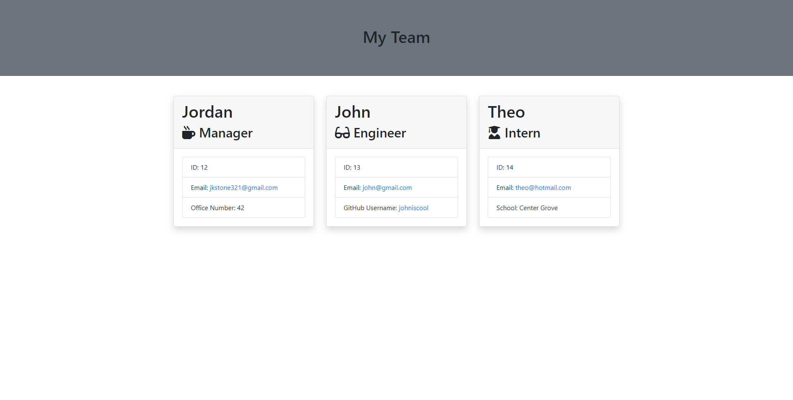

# My Team Generator

  ## Description
  
  This application uses Node.js in the console to generate an HTML file with cards of employees built from the user's input.

  ## Table of Contents

  - [Preview](#preview)

  - [Installation](#installation)

  - [Usage](#usage)

  - [Credits](#credits)

  - [License](#license)

  - [Contact Me](#contact)
  
  ## Preview

  
  
  Link to a video walkthrough using the application
  https://youtu.be/RGDOx_vFtg8
  
  ## Installation
  
  In the terminal use "npm i" to download required modules
  
  ## Usage
  
  To use the application use "node index" in the terminal.

  Follow the prompts and the ending html page will be in the dist folder after you click quit on the prompt
  
  ## Credits
  
  Jordan
  
  ## License
  
  
  
  ## Contact
  
  GitHub: jkstone321

  Email: jkstone321@gmail.com

